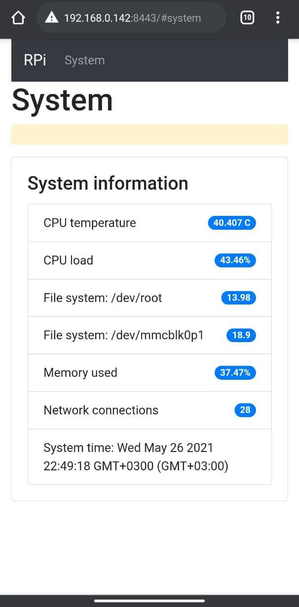

# Rasberry Pi + Node JS



 

## Build 

``` bash
# install dependencies
npm install

# front with vue-dev-server
npm run front-dev

# front build
npm run built-front

# run backend
npm run back-dev
```
